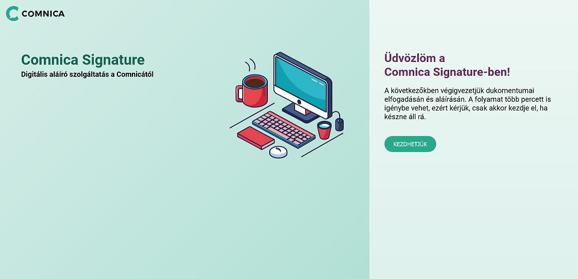

# Comnica Signature

This is József Polgár's solution to the Frontend developer test task.

## Snapshot

## Available Scripts

In the project directory, you can run:

### `npm install`

Installs all the necessary dependencies for this project.

### `npm start`

Runs the app in the development mode.\
Open [http://localhost:5173/](http://localhost:5173/) to view it in your browser.