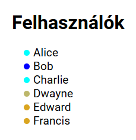

# Frontend developer test

## Available Scripts

In the project directory, you can run:

### `npm install`
Installs all the necessary dependencies for this project.

### `npm start`
Runs the app in the development mode.\
Open [http://localhost:5173/](http://localhost:5173/) to view it in your browser.

### `npm run mock-api`
Starts the mock server that I created for the 3rd task.

## 1st task - Comnica Signature

Run the following scripts in the projects folder:
`npm install`
`npm start`

Open [http://localhost:5173/](http://localhost:5173/) to view it in your browser.

## 2nd task - Button bug
Adott egy gomb. Elvileg minden rendben kód szinten, mégsem csinál semmit se hover, se egyéb eseményre (nem disabled). Mi lehet a probléma, mi okozhat ilyen jelenséget?

- Átlátszó elem van a gomb felett. Többek között position és z-index-re vonatkozó css szabályok okozhatnak ilyesmit.

## 3rd task - User List

Run the following scripts in the projects folder:
`npm install`
`npm start`
`npm run mock-api`

Open [http://localhost:5173/user-list](http://localhost:5173/user-list) to view it in your browser.

Every time, you refresh the page, the colors will change.

## 4th task - Potential input field issues

A designer a következőképpen álmodja meg a beviteli mező működését:

Kitöltetlen állapotban:

Kitöltött állapotban:

Mi lehet ezzel a működéssel az általános probléma?

Elsősorban akadálymentesítéssel kapcsolatos problémák jutnak eszembe:
- Nehezen, vagy egyáltalán nem lehet kijelölni a label szövegét.
- Nehezen, vagy egyáltalán nem lehet kijelölni az input mezőbe beírt szöveget.
- Az input mező magassága túl kicsi ahhoz, hogy 2 sornyi szöveg könnyen olvasható legyen.
- A label mozgásának animációja zavaró lehet.

